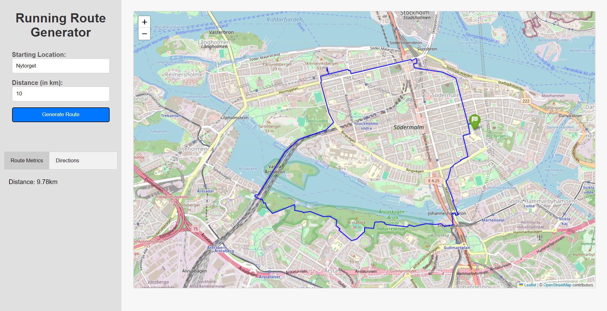

# Running Route Generator

The **Running Route Generator** is a web-based Python application that generates a randomised circular running route based on a user-provided start location and distance.

The app utilises Mapbox, GoogleMaps and Overpass APIs to calculate the route and displays the route on an interactive map using Folium.

## Tech Stack
- Backend: Python, Flask
- Mapping Libraries: Google Maps API, Mapbox API, Overpass API, Folium
- Frontend: HTML, CSS (via Flask's templating engine)
- Environment Management: `dotenv` for handling API keys

## Pre-requisites
- Python 3.x
- API keys - add to a `.env` file in the project root (see [.env.example](.env.sample)):
  - [Mapbox API token](https://account.mapbox.com/access-tokens/)
  - [Google Maps API key](https://console.cloud.google.com/apis/dashboard)
- Flask
- Folium
- Googlemaps
- Overpy

## Usage
Currently the Running Route Generator takes two user inputs - a **starting location** and a **route distance** (in km).

After clicking 'Generate Route', the app will calculate a suggested route and display it on the map:

The *Route Metrics* tab on the left displays the actual length of the suggested route, and the *Directions* tab has turn-by-turn directions for the whole route.

**Methodology:**
- The starting location input uses the Google Maps geocoding API to convert an address into geographic coordinates.
- The centre of a circle that has the starting location on its circumference is calculated - the centre is in a random direction from the starting location, and the size of the circle is scaled to the desired distance of the route.
- A number of waypoints are generated on the circumference of the circle, and adjusted to the closest path.
- The waypoints are passed to the Mapbox directions API to generate a walking route between them.
- A PolyLine representing the route is plotted on the map, and the route information is passed back to the front-end via an AJAX request.  

## Future Development
- Improvements to routing function for areas with less densely-concentrated waypoints.
- Ability to export route data in a FIT file.
- Convert to Android app.
- Option to save routes.
- Include elevation data.